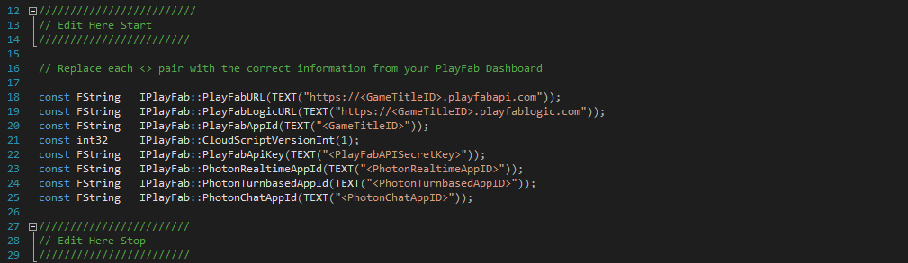
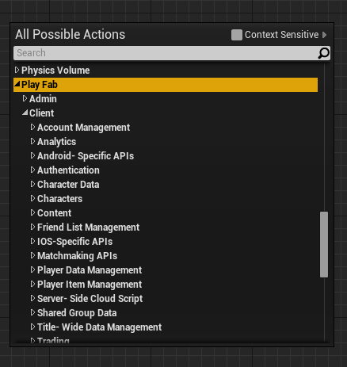
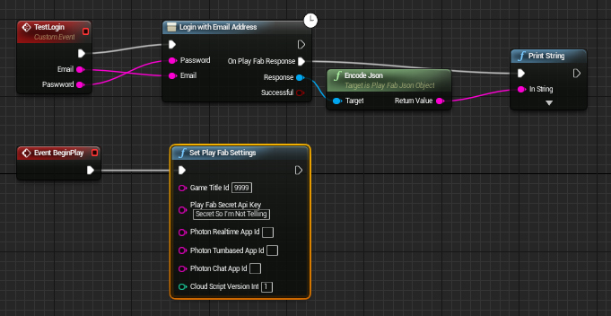

Overview
========

This is the PlayFab integration plugin for [Unreal Engine 4](https://www.unrealengine.com/) that makes REST server communications to the PlayFab back-end service streamlined.

Key features:

* **No C++ coding required**, everything can be managed via blueprints
* Blueprintable FJsonObject wrapper with almost full support of Json features: different types of values, **arrays**, both ways serializarion to FString, etc.
* Blueprintable FJsonValue wrapper - **full Json features made for blueprints!**
* [PlayFab](https://PlayFab.com) REST API manager to start working with PlayFab out of the box!

Current version: **1.0**

Installation:

* Copy all files into your plugins folder. <Projet>/Plugins/PlayFab/
* Generate Visual Studio Files for your project.
* Rebuild your game. **That is it!**

Setup:

* Navigate to the PlayFab.cpp file located in Plugins/PlayFab/Source/PlayFab/Private
* Edit the top part of the file to match the AppId and SecretKeys provided to you by PlayFab.
* Replace <GameTitleID> with your Game Title ID. E.g.("https://0000.playfabapi.com")
* Replace <PlayFabAPISecretKey> with your secret key given to you by PlayFab.

Use:

To use the plugin, drag an API call onto the Event Graph. The API calls and the various categories can be found under Play Fab as can seen in the image below.

Attach the node to an event, pass in the required variables and then attach whatever you want to handle the response up to the graph like below.

**That is all it takes!** The PlayFab nodes will send out the API call, wait for a response and pass back the response from the PlayFab servers. Take a look at their documentation to see what each API call returns and expects.

Note: For the String array pins just make an empty array if you do not want specific key values returned but want them all.

Legal info
----------

Unreal® is a trademark or registered trademark of Epic Games, Inc. in the United States of America and elsewhere.

Unreal® Engine, Copyright 1998 – 2014, Epic Games, Inc. All rights reserved.

